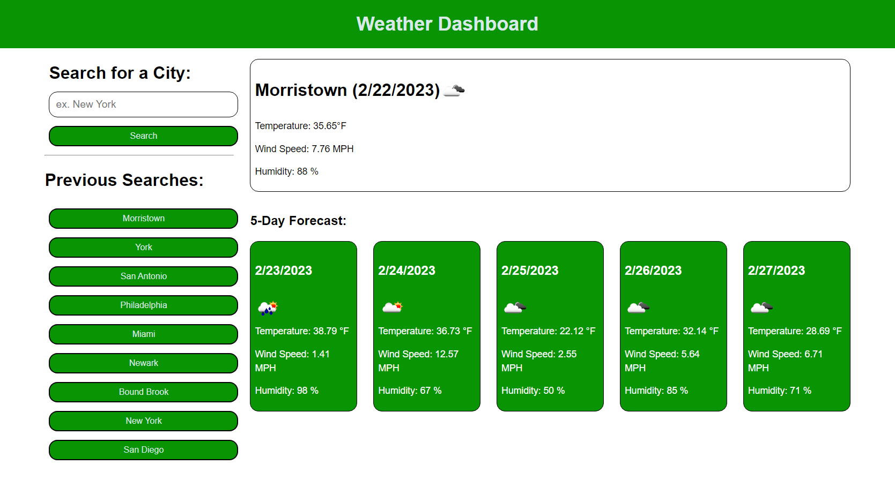

# Weather Dashboard

## Description

This project is designed for users to check the current weather and 5 day forecast of any given city in the US. Whether you want to check the forecast for your day to day activities or you are travelling, this project can help you plan accordingly. The project will also save your recent city searches in case you are traveling between multiple cities.

## Table of Contents

- [Project Links](#links)
- [Usage](#usage)
- [Screenshots](#screenshots)
- [Credits](#credits)
- [License](#license)
- [Contributing](#contributing)
- [Tests](#tests)
- [Questions](#questions)

## Links

- [Deployed Application](https://jeaustins27.github.io/Weather-Dashboard/)
- [GitHub Repo](https://github.com/jeaustins27/Weather-Dashboard)

## Usage

Type the name of any city into the form and press "Search". This will render the current weather and 5 day forecast of the given city which will include the temperture, weather icon, wind speed, and humidity. If you would like to see the forecast for previous cities you had searched, simply click the button of the previous city and it will render the forecast.

## Screenshots

## Credits

- [W3Schools](https://www.w3schools.com/)
- [Readme.so](https://readme.so/)
- [Stack Overflow](https://stackoverflow.com)
- [Open Weather Map](https://openweathermap.org/forecast5)

## License

This project is licensed under the [MIT](https://choosealicense.com/licenses/mit/) license.

## Contributing

You can help with contributing by reaching me via email.

## Tests

If you do not enter the name of a valid city in the USA, you will receive an alert that will say "City not found"

## Questions

If you have any questions you can reach out via [Email](mailto:JeaustinS27@gmail.com) or you can check out my GitHub profile at here: [GitHub](https://github.com/jeaustins27)
